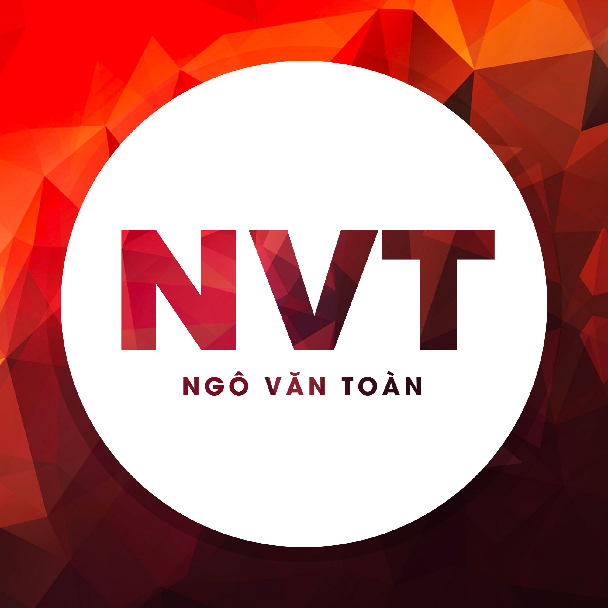

<h2 align="center">👽 Personal-Ngô Văn Toàn 👽</h2>
 

    
  </a>
  
  
  

 
<h1 align="center">Hi 👋, I'm Ngô Văn Toàn</h1>
<h3 align="center">계속 인생은 아름답고 웃어야 할 일로 가득차 있다.</h3>

  

  

  

- 🌱 I’m currently learning **Information Technology**

- 📝 I regularly write articles on [https://ngovantoanttb.blogspot.com](https://ngovantoanttb.blogspot.com)

- 💬 Ask me about **Xin chào bạn 😚**

- 📫 How to reach me **ngovantoan1305y@gmail.com**

- 📄 Know about my experiences [https://ngovantoanttb.blogspot.com/2022/03/hay-lua-chon-nganh-ung-e-khong-phai-hoi.html?m=1](https://ngovantoanttb.blogspot.com/2022/03/hay-lua-chon-nganh-ung-e-khong-phai-hoi.html?m=1)

### Blogs posts
<!-- BLOG-POST-LIST:START -->
<!-- BLOG-POST-LIST:END -->

<h3 align="left">Connect with me:</h3>

<h3 align="left">Languages and Tools:</h3>

 

 

 

 

 

 

 

 

 

 

 

 

 

 

 

 

 

 

 

 

&nbsp;

